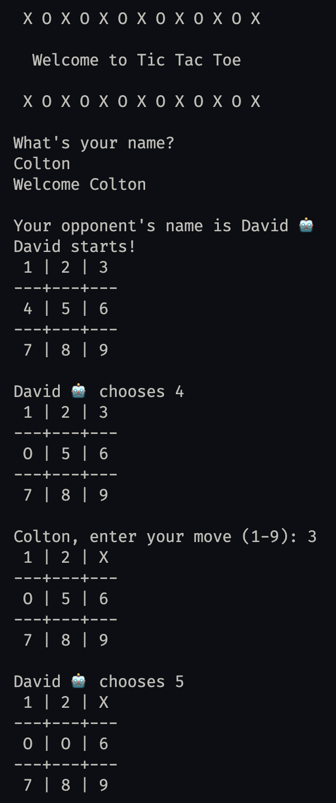

# TicTacToe (C# Console App)

A simple console-based Tic Tac Toe game written in C#.

## How to Run

1. Open a terminal and navigate to the project directory.

2. Build the project:

   ```sh
   dotnet build
   ```

3. Run the app:

   ```sh
   dotnet run
   ```

## Features

- Play Tic Tac Toe against a computer opponent.
- Random computer names for variety.
- Simple, clear console interface.

## UI


## Requirements

- [.NET 7.0 SDK](https://dotnet.microsoft.com/en-us/download/dotnet/7.0) or later

---

Enjoy playing! 😊
